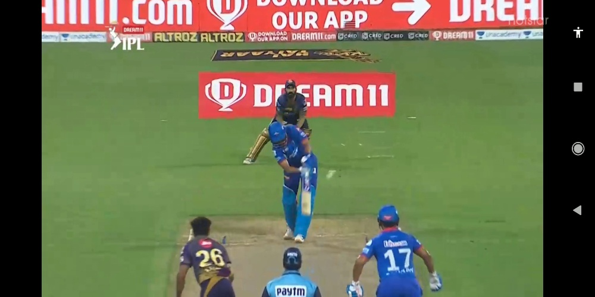

## Cricket bat and ball impact detection     
The results is showing the frame where bat hit the ball. 





```
git clone https://github.com/MotiBaadror/cricket_video_analysis
cd cricket_video_analysis 
pip install - r requirements.txt
```
download the pretrained model from [here](https://github.com/OlafenwaMoses/ImageAI/blob/master/imageai/Detection/VIDEO.md#videodetection)    

Keep the weights in the checkpoints folder    
Keep the video in data/ folder    
## Results from tensorflow model 

    

Use ```inference_tf2_colab.ipynb``` to get the results from models of tensorflow model. 
You can try several different configs available [here](https://github.com/tensorflow/models/tree/master/research/object_detection/configs/tf2)


## Image_AI results    

```
cd src 
python image_ai_inference.py
```

image_ai_inference.py to get the json for the cooridinate      
results will be saved in the results dir     
after that to get  the frame where bat hits ball 

```
python generate_results.py
```
To get the final output I am calculating euclidian distence between bet and ball.    
```
dst = math.sqrt((x1-x2)**2+(y1-y2)**2)
```

The notebook contain all the helper code which is not organised. 


